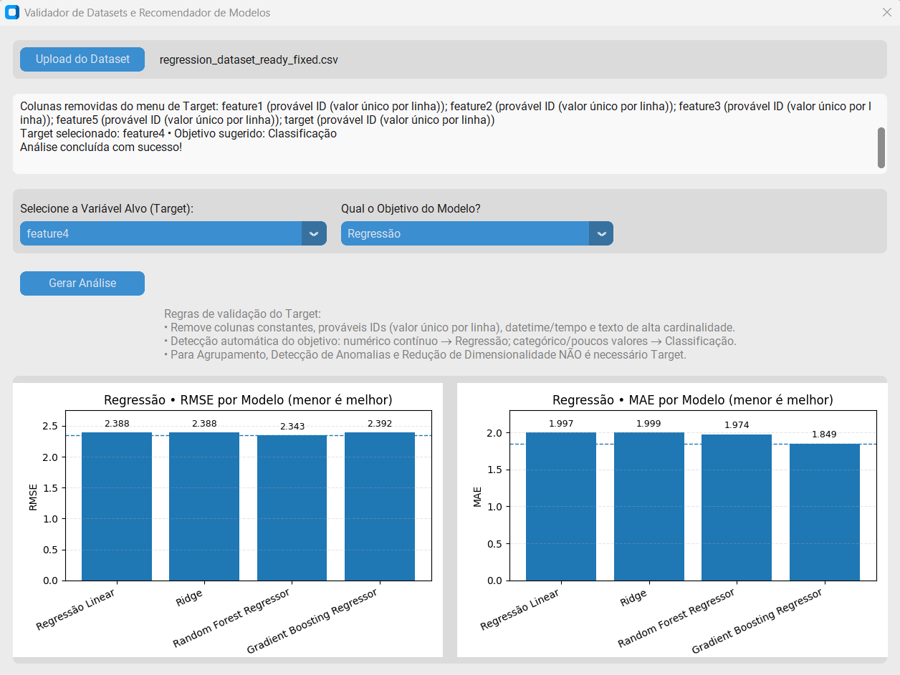
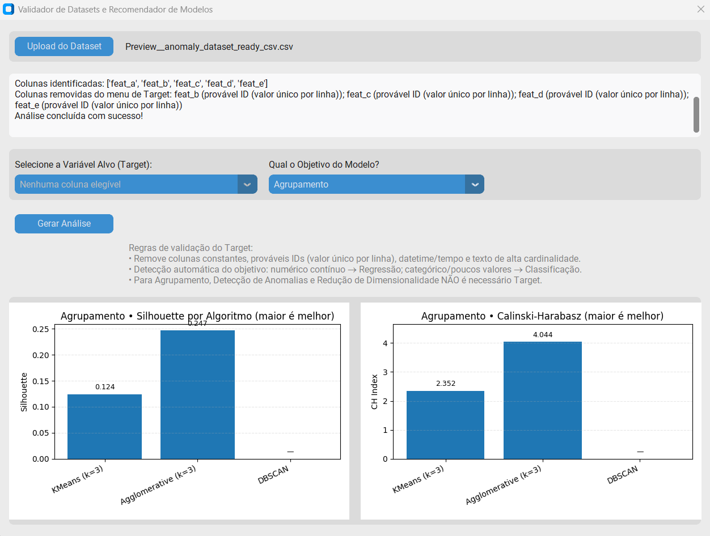
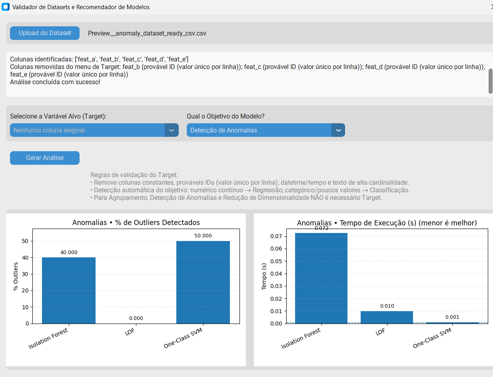
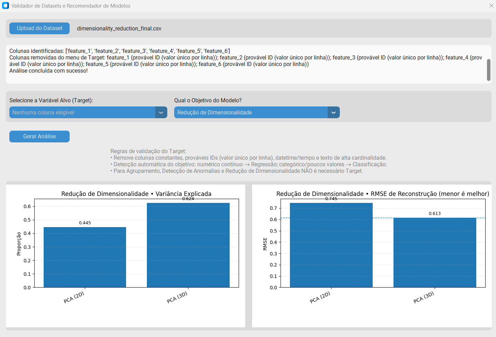

# Irovafed Carol’s Navigator

## Origem da ideia

A ideia do meu projeto nasceu de dois lugares:

- **Nas entrevistas:** eu sentia que a conexão entre “Dados” soava abstrata demais. Eu queria mostrar como eu poderia contribuir para isso, não só falar.
- **Nos meus próprios estudos:** a ficha caiu de vez quando, em um challenge, precisei encontrar o melhor modelo de Machine Learning para prever a cotação do IBOVESPA.

A partir daí, pensei em desenvolver uma solução que pudesse automatizar essa escolha para qualquer problema de negócio.

Juntando a necessidade que vi no mercado com a dor que eu mesma senti nos estudos, nasceu o **Irovafed Carol’s Navigator 🚀**.

---

## O que é o Irovafed Carol’s Navigator

O Irovafed Carol’s Navigator é uma aplicação interativa que recomenda algoritmos de Machine Learning do scikit-learn com base nas respostas do usuário. A ferramenta inclui também um **validador automático** que carrega seus dados, executa múltiplos modelos e compara seus resultados instantaneamente.

Ele funciona como um atalho inteligente para direcionar a escolha de modelos, evitando tentativas aleatórias e acelerando o início das análises.

A ferramenta foi projetada para uso educacional e de prototipagem, permitindo que profissionais e estudantes de dados explorem rapidamente opções adequadas ao seu contexto, sem substituir etapas essenciais como avaliação, ajuste e validação aprofundada.

---

## Onde o aplicativo brilha

- **Educação e aprendizado:** perfeito para estudantes e/ou iniciantes que querem entender qual modelo pode se aplicar ao seu problema.
- **Prototipagem rápida:** ajuda a iniciar um projeto testando hipóteses sem perder tempo escolhendo manualmente entre dezenas de algoritmos.
- **Workshops e demonstrações:** ótimo recurso visual para explicar conceitos de ML de forma prática.

---

## Onde ele não se aplica

- **Projetos críticos e de produção:** não substitui avaliação de métricas, tuning de hiperparâmetros, feature engineering ou seleção de modelo baseada em experimentos rigorosos.
- **Problemas complexos:** casos que envolvem dados massivos, arquiteturas customizadas ou integrações específicas exigem análise manual.
- **Acurácia final:** o app aponta um caminho, mas não garante que o modelo recomendado seja o melhor para o seu dataset sem ajustes.

---

## O que esperar dos resultados

Ao selecionar o tipo de problema e carregar seu dataset no **Validador de Modelos**, o Irovafed Carol’s Navigator executa análises comparativas e apresenta saídas visuais e textuais específicas para cada objetivo.

---

### 🔹 Regressão

**O que é feito:**
Treina múltiplos modelos de regressão de baseline (como Regressão Linear, Ridge, Random Forest e Gradient Boosting) nos seus dados.

**O que é mostrado:**
- **Gráficos de barras comparando o desempenho** dos modelos.
- **Métricas de erro:** RMSE (Root Mean Squared Error) e MAE (Mean Absolute Error) para cada modelo. O objetivo é identificar modelos com **menor erro**.
- Uma linha tracejada indica o melhor desempenho para facilitar a comparação visual.

**Exemplo real:**


---

### 🔹 Classificação

**O que é feito:**
Treina vários modelos de classificação (como Regressão Logística, KNN, Random Forest e Gradient Boosting) para prever as classes do seu target.

**O que é mostrado:**
- **Gráficos de barras comparando a performance** dos principais algoritmos.
- **Métricas principais:** Acurácia (percentual geral de acertos) e Recall (capacidade do modelo de encontrar todas as amostras de uma classe).
- Isso permite uma visão rápida de quais modelos são mais promissores para o seu problema.

**Exemplo real:**


---

### 🔹 Agrupamento

**O que é feito:**
Aplica diferentes algoritmos de clustering (K-Means, Aglomerativo, DBSCAN) para descobrir grupos nos seus dados sem usar um target.

**O que é mostrado:**
- **Gráficos de barras comparando a qualidade** dos clusters formados por cada algoritmo.
- **Métricas de avaliação de cluster:**
  - **Silhouette Score:** Mede quão bem separado e coeso um cluster é (valores mais próximos de 1 são melhores).
  - **Calinski-Harabasz Index:** Mede a razão entre a dispersão entre clusters e a dispersão intra-cluster (valores mais altos são melhores).

**Exemplo real:**


---

### 🔹 Detecção de Anomalias

**O que é feito:**
Utiliza algoritmos não supervisionados (Isolation Forest, Local Outlier Factor, One-Class SVM) para identificar pontos que fogem do padrão normal dos dados.

**O que é mostrado:**
- **Percentual de anomalias detectado** por cada modelo, permitindo comparar a sensibilidade de cada um.
- **Tempo de execução** de cada algoritmo, uma métrica importante para avaliar a escalabilidade.

**Exemplo real:**


---

### 🔹 Redução de Dimensionalidade

**O que é feito:**
Aplica PCA (Principal Component Analysis) para projetar os dados em 2 e 3 dimensões.

**O que é mostrado:**
- **Gráfico de Variância Explicada:** Mostra o quanto da informação original dos dados é preservada na projeção (quanto maior, melhor).
- **Gráfico de RMSE de Reconstrução:** Mede o erro ao tentar reconstruir os dados originais a partir da versão reduzida (quanto menor, melhor).

**Exemplo real:**


---

## Pré-processamento automático realizado pelo app

O Irovafed Carol’s Navigator já aplica automaticamente:

- Remoção de colunas com valores únicos (potenciais IDs).
- Imputação de valores numéricos faltantes com a mediana.
- Padronização (StandardScaler) para algoritmos sensíveis à escala.
- Compatibilidade com datasets `.csv` com cabeçalho na primeira linha.

---

## Formato esperado dos arquivos

- O arquivo deve estar em formato `.csv`.
- É esperado que a primeira linha seja o cabeçalho com os nomes das colunas.
- Os valores podem estar separados por vírgula (`,`) ou ponto e vírgula (`;`).
- Para tarefas supervisionadas, deve conter pelo menos uma coluna que possa servir como variável alvo (target) válida.

---

## Preparação recomendada do dataset por objetivo

**🔹 Regressão**
- Target: variável numérica contínua (ex.: preço, temperatura, vendas).
- Dados: evite que o target seja único em todas as linhas.
- Features: normalizar ou padronizar pode ajudar, mas o app já cuida disso para alguns modelos.

**🔹 Classificação**
- Target: variável categórica (binária ou multiclasses).
- Dados: cada classe deve ter exemplos suficientes para treinar.
- Equilíbrio: balanceamento de classes pode melhorar a performance.

**🔹 Agrupamento**
- Target: não deve existir (aprendizado não supervisionado).
- Dados: apenas variáveis numéricas ou codificadas.
- Escala: o app já aplica padronização automática.

**🔹 Detecção de Anomalias**
- Target: não é necessário (não supervisionado).
- Dados: conter variáveis que representem o comportamento “normal” para permitir detectar desvios.
- Proporção: anomalias devem ser minoria no dataset.

**🔹 Redução de Dimensionalidade**
- Target: não necessário.
- Dados: pelo menos 2 variáveis numéricas.
- Escala: padronização já aplicada pelo app, mas remover colunas irrelevantes ajuda.

---

## Instruções de Uso

Para utilizar o **Irovafed Carol’s Navigator** na sua máquina, siga este passo a passo simples:

1.  **Pré-requisitos**
    - Ter o **Python 3.8+** instalado.
    - Ter as bibliotecas necessárias instaladas. Você pode instalar todas de uma vez com o arquivo `requirements.txt`:
      ```bash
      pip install -r requirements.txt
      ```
      *(Caso o arquivo `requirements.txt` não esteja no repositório, você pode criá-lo com `pip freeze > requirements.txt` ou instalar as bibliotecas da lista abaixo manualmente).*

2.  **Executando o aplicativo**
    - Baixe ou clone este repositório.
    - No terminal ou prompt de comando, navegue até a pasta do projeto.
    - Execute o arquivo principal (vamos supor que se chame `app.py`):
      ```bash
      python app.py
      ```

3.  **Usando o app**
    - Explore as duas funcionalidades:
      - **Navegador:** Responda às perguntas para receber recomendações de modelos, copiar snippets de código e acessar a documentação.
      - **Validador:** Clique no botão "Validador", carregue seu arquivo `.csv`, escolha o objetivo e aguarde a análise automática para visualizar os gráficos e métricas comparativas.

💡 *Dica:* Para melhores resultados, siga as recomendações da seção **Preparação recomendada do dataset por objetivo**.

## Idiomas suportados

- Português 🇧🇷
- Inglês 🇺🇸
  *A tradução é feita de forma automática ao mudar a configuração no app.*

---

## Tecnologias usadas

- Python 3
- CustomTkinter para interface gráfica.
- scikit-learn para algoritmos de Machine Learning.
- Pandas / NumPy para manipulação de dados.
- Matplotlib para os gráficos.
- PIL para imagens.

---

## Licença

Este projeto é distribuído sob a licença MIT.
